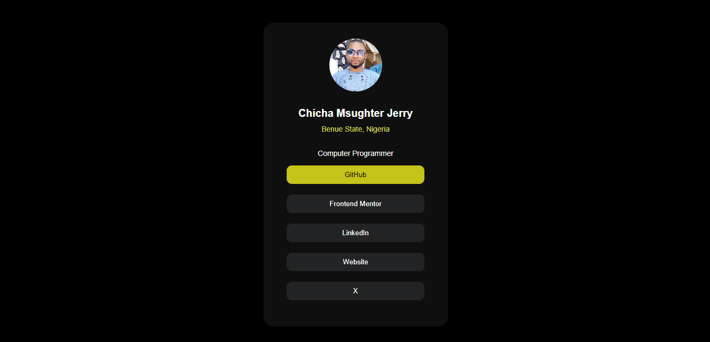

# Frontend Mentor - Social links profile solution

This is a solution to the [Social links profile challenge on Frontend Mentor](https://www.frontendmentor.io/challenges/social-links-profile-UG32l9m6dQ). Frontend Mentor challenges help you improve your coding skills by building realistic projects. 

## Table of contents

- [Overview](#overview)
  - [The challenge](#the-challenge)
  - [Screenshot](#screenshot)
  - [Links](#links)
- [My process](#my-process)
  - [Built with](#built-with)
  - [What I learned](#what-i-learned)
  - [Continued development](#continued-development)
  - [Useful resources](#useful-resources)
- [Author](#author)
- [Acknowledgments](#acknowledgments)


## Overview

### The challenge

Users should be able to:

- See hover and focus states for all interactive elements on the page

### Screenshot




### Links

- Solution URL: (https://github.com/mcquest72/social-links-profile)
- Live Site URL: [Add live site URL here](https://your-live-site-url.com)

## My process

### Built with

- HTML
- CSS


### What I learned

My major learnings while working through this project concepts like selectors, buttons, anchor tags and mouse hovering.

T code snippets, see below:

```html
<button><a href="https://github.com/mcquest72" target="_blank">GitHub</a></button>
```
```css
button {
    background-color: #222324; 
    color: #fff; 
    display: flex;
    border-radius: 10px;
    margin: auto;
    padding: 10px 20px; 
    border: none; 
    cursor: pointer;
    margin-bottom: 20px;
    width: 90%;
    text-align: center;
}

button:hover, button:hover a {
    background-color: rgb(196, 196, 26);
    color: black;
}


a{
    text-decoration: none;
    color: white;
}
```


### Continued development

I will like to continue focusing on responsive design in future projects. This concepts is new to me and am not completely comfortable with it, although I found responsive design useful which is necessary skill for me to refine and perfect.


### Useful resources

- [w3school](https://www.w3schools.com/) - This helped me gain some insight to the structure of html. I really liked this platform and will use it going forward.

## Author

- Author - [Chicha Msughter Jerry](https://www.your-site.com)
- Frontend Mentor - [@mcquest72](https://www.frontendmentor.io/profile/mcquest72)
- Twitter - [@mcquest72](https://www.twitter.com/mcquest72)


## Acknowledgments

I wish to say a big thank you to Frontend Mentor for this wonderful challenge. It has really broaden my horizon on frontend developement, it has also helped me advance my knowleged in git and GitHub.

I wish to also thank my mentor @katfogy for his guidance of which without him, I wouldn't have known about frontend mentor, thank you boss.

